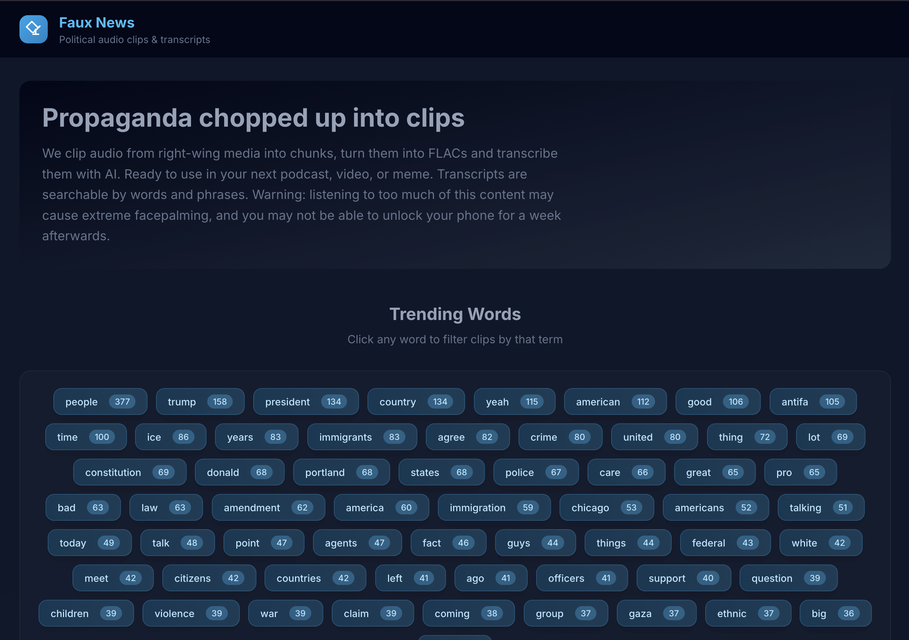
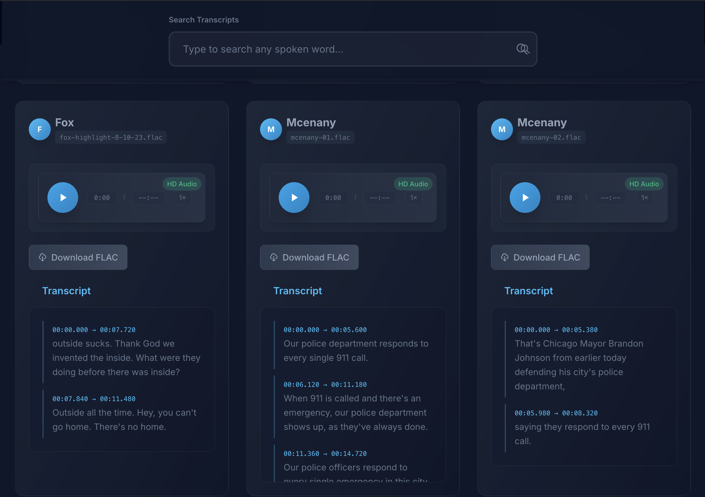

# Faux News Audio Samples


This repository contains a large collection of far-right commentary/bullshit audio samples that are automatically transcribed and presented in a searchable index. The goal is to provide an archive samples for musicians everywhere but with an index of what was said.


## 📁 Structure

```
.
├── docs/                      # Site source (Eleventy)
│   ├── _includes/             # Nunjucks layouts/partials
│   ├── public/                # Built CSS/JS assets
│   ├── _site/                 # Generated static site (build output)
│   ├── src/                   # Frontend source (JS, CSS)
│   ├── index.njk              # Home page template
│   └── package.json           # Site deps/scripts
├── samples/                   # Audio corpus (organized A–Z / speaker / audio|text)
│   ├── b/
│   │   └── bondi/
│   │       ├── audio/         # .flac (source) and .mp3 (web) files
│   │       │   └── bondi-epstein-01.{flac,mp3}
│   │       └── text/          # .vtt/.txt transcripts
│   │           └── bondi-epstein-01.{vtt,txt}
│   └── w/
│       └── watters/
│           ├── audio/
│           └── text/
├── scripts/                   # Ingestion/build scripts (ffmpeg, organize, etc.)
├── .github/workflows/         # CI to build & deploy Pages
└── README.md                  # This file
```




## 📝 About

Audio files in `samples/` are transcribed and an HTML index is generated in `docs/index.html` so the content can be browsed locally or via GitHub Pages. The transcripts include:

- ⏱️ Timestamped segments
- 🔍 Full-text search capability  
- 📱 Mobile-responsive interface
- 🎵 Embedded audio players

## 📊 Content Organization

Audio files are organized under `samples/` into letter → name subfolders (e.g., `samples/m/miller/miller-01.aiff`). Each file is processed to extract:

- Full transcript text
- Timestamp-aligned segments
- Searchable content index

## 🔗 Links

- [The Website](https://voxpopulist.github.io/fauxnews)
- [Raw Audio Files](./docs)
